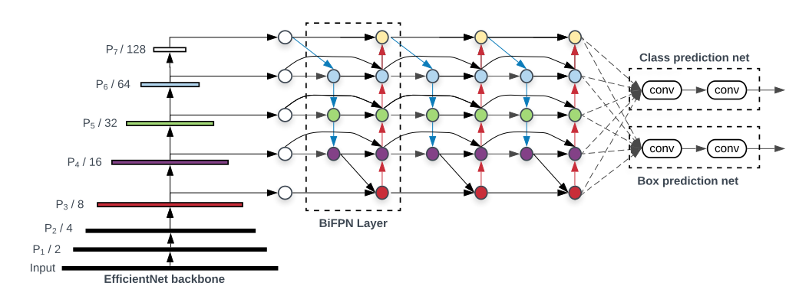
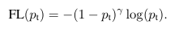
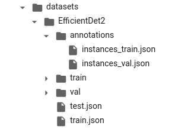

# EfficientDet to detect fracture in xray images 

## Model

### Backbone _*EffitionNet*_
*_EfficientNet_* is stack of blocks which are inspired by *_MobileNet_*. In the original [paper](https://arxiv.org/abs/1704.04861v1),
the authors introduce a new technique called **Depthwise convolution**. It reduces a lot of calculating operations compare to a
normal convolution, namely, you can read this [page](https://towardsdatascience.com/review-mobilenetv1-depthwise-separable-convolution-light-weight-model-a382df364b69).

The other layer used in the baseline is SE-Net which method can apply attention to boot the ability of capture features.
Each block compose of some parts: squeeze module, excitation module, scale module.

This architecture proposes a novel pipeline:
    
- Using *_global adapt average pooling_* to reduce the tensor shape to (1, 1, C).
- Hidden state reduces this by a factor r, this leading to (1, 1, C/r) tensor.
- Project back to the same dimensional space as the input and apply *_Softmax_* to transform the digits.
- Multiple element-wise with the input tensor.

The residual architecture also used to make this model avoid vanishing problem very well.

### Neck _*BiFPN*_
This **BiFPN** has some different compare to other FPN based part:

- Remove nodes that only have one input
- Add extra edge between the origin input and output if they are at the same level
- Repeat the layer multiple times

This model use **Fast normalized fusion** to weight the feature map in different layers when combination. It can also boot the speed when running in GPU than softmax method.

### RetinaHead and Focal loss
RetinaHead is announced in 2018 with the [paper](https://arxiv.org/pdf/1708.02002v2.pdf). This can address the unbalance data problem by using a new loss function named *_focal loss_*.
From Cross Entropy loss function, by adding a weight factor and modulating factor, it can increase the effect of rare class which is most
important. Beautiful representation is showed in this image:

## Implementation
All the implementation based on the [github](https://github.com/zylo117/Yet-Another-EfficientDet-Pytorch.git).
### Prepare dataset
I used the COCO format in my task with my custom like: 
### Training 
Training process is in the .ipynb file.

