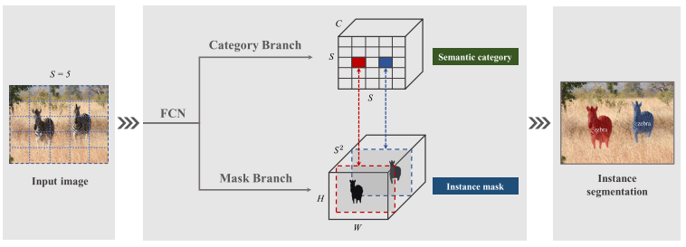
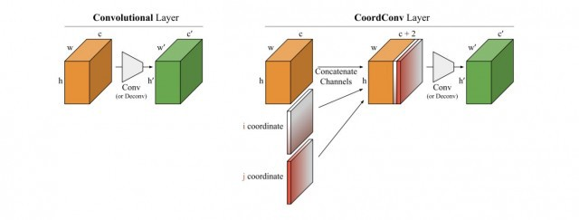
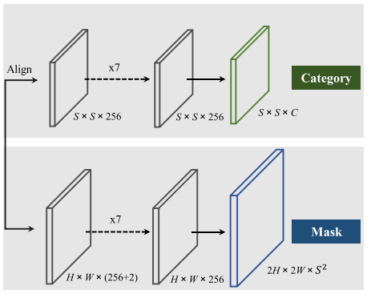
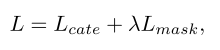
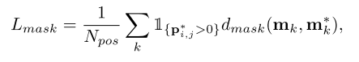
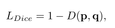
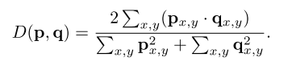
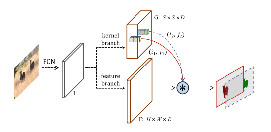
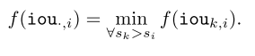
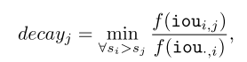

# Solo for Xray segmentation

## Table of contents
- [Introduction](#Introduction)
- [SOLOv1](#SOLOv1)
- [SOLOv2](#SOLOv2)
- [Implementation](#Implementation)
- [Result](#Result)

## Introduction
**SOLO** is a novel method for instance segmentation which uses a different approach:

- No anchor box is needed. :flushed:
- No normalization is needed. :flushed:
- No bounding box detection is needed. :flushed:

Now, let's dump into it. :relieved: :relieved: :relieved:

## SOLOv1
The general architecture is showed below:

### CoorConv layer

#### Why not conventional convolution? :worried:

The author of the original [paper](https://arxiv.org/pdf/1807.03247.pdf) points out the falling of convolution in some simple trivial task:

- Supervised rendering: Given some Cartesian coordinate (i, j), highlight the square around this center with fixed size in the 'black' image (a grayscale image with value 0 in each pixel).
- Supervised coordinate classification: Given some Cartesian coordinate (i, j), provide its correspond one hot vector representation.
- Supervised regression: Same as *_Supervised coordinate classification_* but with the inverse direction.

#### Explanation :raised_hand:

- CNN is pixel-invariant.
- This is too hard for CNN to map data from lower dimensions to higher dimensions.
- CNN fails to learn a smooth function to represent a dataset.

#### **CoorConv** is the solution :boom:

 **CoorConv** concatenates additional dimensions to an input which annotate the coordinate of each pixel follow by normal convolution layer. By this
approach, a filter is able to know the position of each pixel and break down the invariant character. I think it's useful for some tasks which need the 
coordinate prediction like object detection, segmentation, ...
### Backbone
Model uses Resnet architecture for extract features.
### Neck
FPN is employed for multiple scales prediction.
### Head

This model gets each feature map from FPN as inputs. The head at the top layer uses
simultaneous 2 branches to predict each category and correspond mask.  
- Semantic category:
  With each grid, this branch predicts correspond logit vector and classify this grid to class which have the largest probability.
- Instance mask:
  Using **CoorConv** layer at first and apply convolution multi time, we achieve a tensor with each channel is a soft mask associated with each grid. **NMS** is also used to obtain the final result.
### Loss function
Training loss function is defined as follows:

Model uses **Focal loss** for penalty classification loss.

The formulations of mask loss are represented as follows:

where, the author chooses **Dice loss** as *_metric_*:

## SOLOv2
### *_Bottlenecks_* of the past version
Compare to the version 1, the author points out some defects:

- Inefficient mask representation and learning
- Not high enough resolution for finer mask predictions
- Slow mask NMS

This version addresses all the above problems by designing lots of new techniques.

### Dynamic instance segmentation
This paper proposed a new head with some changes in head branch:

Instead of predicting the mask segmentation for each grid which occupies a huge memory and needs a lot of calculation, this model tries to
predict **kernel** and **feature** (mask = conv_kernel(feature)).

- #### Mask kernel
  With each feature map, this model applies **CoorCov** and stack of convolution layers to make a tensor which have size SxSxD where,
  SxS is number of grid and D indicates the weights for each grid.
- #### Mask feature
  The author proposes the way to make a unified and high-resolution mask feature from outputs in FPN by using convolution, group norm,
ReLU, bilinear upsampling (like U-net). Simple :grin:

### Matrix NMS
NMS is a filter which reduce significant region proposals by keeping a region with highest score and remove a region with lower score
and union larger than a threshold. In this hard way, it makes our model lower because of the recursion which is used to implement. To boost the 
speed of this stage and increase the accuracy, this model employs **Matrix NMS**. This method utilizes the [Soft-NMS's](https://arxiv.org/pdf/1704.04503v2.pdf) idea
which use decay to reduce a score instead of removing the proposal immediately. This model calculates a decay as following formula:

where, s is a score corresponding each region and f can be a linear function or Gaussian function. 

fantastic to [deep diving](https://towardsdatascience.com/non-maximum-suppression-nms-93ce178e177c) :blush:

## Implementation

## Result
